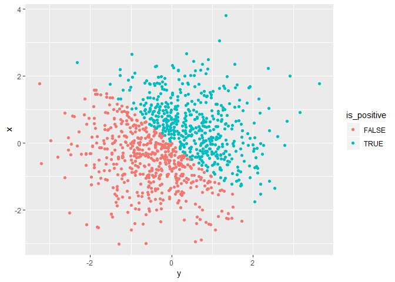
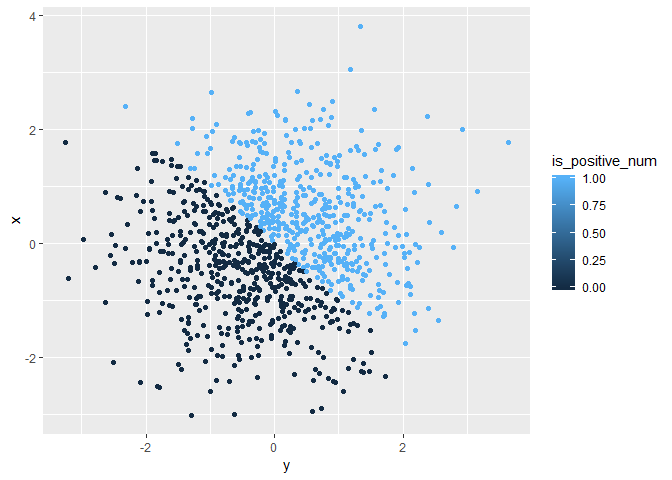
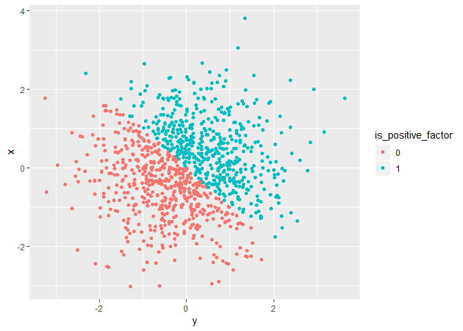

p8105\_hw1\_cj2493
================
Courtney Johnson
2018-9-13

Problem 1
---------

Create a data frame that includes a random sample of size 10 from a uniform \[0,5\] distribution, a logical vector indicating whether the elements of the sample are greater than 2, a length-10 character vector, and a length-10 factor vector.

``` r
set.seed(1)
problem_1_df = tibble(
  vec_numerical = runif(10, min = 0, max = 5),
  vec_logical = vec_numerical > 2,
  vec_char = c("Courtney", "Patrick", "Evelyn", "Glenn", "Sue", "Glen", "Jenny", "Kayla", "Lindsay", "Derick"),
  vec_factor = factor(c("female", "male", "female", "male", "female", "male", "female", "female", "female", "male"))
)
```

Now, attempt to take the means of the vectors, and explain what happens.

``` r
numerical_mean = mean(problem_1_df$vec_numerical)
logical_mean = mean(problem_1_df$vec_logical)
char_mean = mean(problem_1_df$vec_char)
```

    ## Warning in mean.default(problem_1_df$vec_char): argument is not numeric or
    ## logical: returning NA

``` r
factor_mean = mean(problem_1_df$vec_factor)
```

    ## Warning in mean.default(problem_1_df$vec_factor): argument is not numeric
    ## or logical: returning NA

The mean(x) function works for the numerical and logical vectors, but not for the character and factor vectors. For the character and factor vectors, NAs are returned because mean(x) only accepts input in numerical or logical forms.

Now, attempt to use as.numeric() on the logical, character, and factor vectors.

The logical and factor vectors were converted to a numeric vector, but the character vector was not.

Now, convert the character vector to a factor vector, and then try as.numeric() again. Also, convert the factor vector to a character vecotr and try as.numeric() again.

``` r
char_to_factor = factor(problem_1_df$vec_char)
convert_char_2 = as.numeric(char_to_factor)
factor_to_char = as.character(problem_1_df$vec_factor)
convert_factor_2 = as.numeric(factor_to_char)
```

    ## Warning: NAs introduced by coercion

This time, the character vector was successfully converted to a numeric vector by using an intermediate factor vector. However, we cannot convert the factor vector to numeric with an intermediate character vector.

Problem 2
---------

Create a data frame of x, y (both random samples of size 1000 from a normal distribution), a logical vector indicating whether x + y &gt; 0, a numeric vector made by coercing the logical vector, and a factor vector made by coercing the numeric vector.

``` r
set.seed(1)
problem_2_df = tibble(
  x = rnorm(1000),
  y = rnorm(1000),
  is_positive = x + y > 0,
  is_positive_num = as.numeric(is_positive),
  is_positive_factor = factor(is_positive_num)
)
```

Describe the Vector with inline R code:

The size of the dataset is 1000 by 1000. The mean of x is -0.0116481 and the median of x is -0.0353242. The proportion of cases for which the logical vector is true is 0.49.

Now, make scatterplots of y vs x, alternatively coloring points using the logical, numeric, and factor vectors.

``` r
logical_plot = ggplot(problem_2_df, aes(x = y, y = x, color = is_positive)) + geom_point()
numeric_plot = ggplot(problem_2_df, aes(x = y, y = x, color = is_positive_num)) + geom_point()
factor_plot = ggplot(problem_2_df, aes(x = y, y = x, color = is_positive_factor)) + geom_point()

logical_plot
```



``` r
numeric_plot
```



``` r
factor_plot
```



``` r
ggsave("logical_plot.pdf", plot = logical_plot, path = "./")
```

    ## Saving 7 x 5 in image

The color options for the logical and factor plots are the same; they both only have two options. This is because there are only discrete different options for values in these vectors (true or false, and the given levels). However, the color options for the numeric plot exists on a gradient, because in a numeric vector, the values can be anything from negative infinity to positive inifinity.
